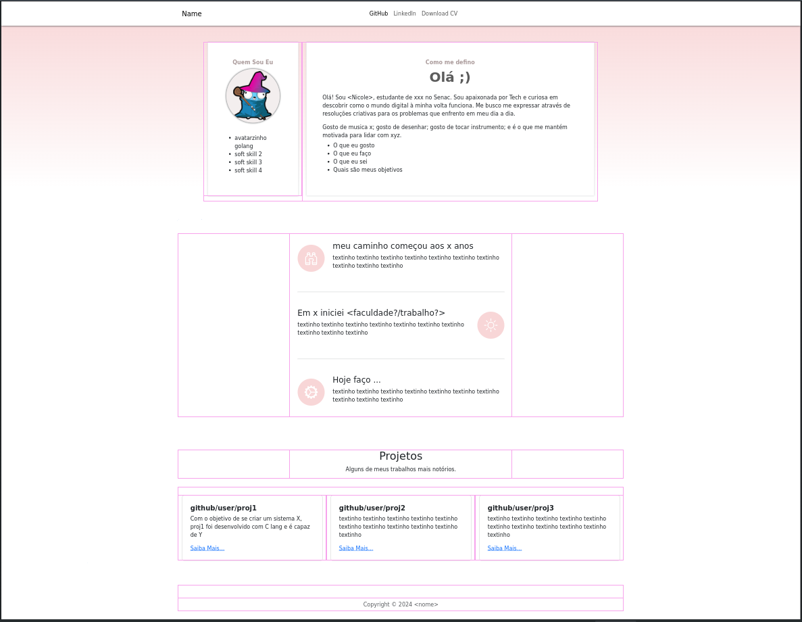

# Portifólio

Imagem da página principal. Essa imagem conta com as linhas, meio rosa, (guias) que mostram as `div`s. O código final não possui essas linhas.

Troque os textos por algo que te agrade.

Esse projeto é interessante, para dar visibilidade e contar um pouco de sua personalidade para possíveis contratantes e contribuidores.

Feito com:
- bootstrap

---

## Hospedar na Internet

É possível hospedar a página no github-pages e criar um site estático (igual ao meu https://farinap5.com) de forma gratuita.

Método 1
- Crie um repositório com o nome no estilo "`<username do github>.github.io`"
- Crie o commit contendo os arquivos.
- Na barra de tarefas, vá em `settings` > `pages`. 
- Configure a **branch** que contém os arquivos do site (html css, js e o que for), pode ser a **main** mesmo, pois o repositório contém apenas os arquivos do site.

Método 2

Neste método, é possível configurar qualquer domínio, e não apenas subdomínios do github "`<username do github>.github.io`". Como por exemplo, meu subdomínio era `farinap5.github.io`, mas acabei comprando um, o `farinap5.com`. Também é possível configurar qualquer repositório para hospedar o site.

- Compre um domínio (em namecheap por exemplo)
- Crie entradas DNS `A` apontando para os IPs do github-pages.
- - Configure a **branch**

Após um momento, o _deploy_ será feito automaticamente pelo github e o site está publicado.

Referência
- https://docs.github.com/pt/pages/getting-started-with-github-pages/configuring-a-publishing-source-for-your-github-pages-site

---

Alterações:
- Tudo pode ser alterado no HTML.
- Mude a imagem na linha 39, que está em `assets/img/avatar.png`, a nova imagem pode ser um link ou mesmo um arquivo. Ela deve tem **n** por **n** onde **n** é arbitrário, ou seja, deve ser quadrada.
- Troque a mensagem de copyright para seu nome, na parte baixa (footer).
- Eu gosto dessa cor (salmão), ela pode ser trocada em qualquer aparição da cor `#f8d6d7` ou algo próximo disso.
- Talvez algumas alterações quebre o estilo, mas da para concertar, apenas tente manter os tamanho dos textos, com a mesma quantidade de linhas, isso deve manter a harmonia dos blocos.

!!Mantenha o repositório privado (ou não)!!